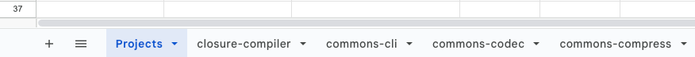

# Tratto - Ground Truth Dataset
The repository contains the ground truth dataset of the tratto project.

## Setup
Execute the following command to setup the projects to analyze:

```bash
    bash init.sh
```

The script will clone each project of the ground truth dataset and will set the HEAD to the specific commit to analyze.

## Repository Structure
After initializing the current repository, each project will be contained within a folder with the following structure:
```
[root]
    |--[project_name_1]
    |           |--[classes]
    |           |       |-- ClassToAnalyze1.java
    |           |       |-- ClassToAnalyze2.java
    |           |       |   ...
    |           |       |-- ClassToAnalyze10.java
    |           |--project
    |           |--class_list.csv
    |           |--oracles.csv
    |--[project_name_2]
    |           |--[classes]
    |           |       |-- ClassToAnalyze1.java
    |           |       |-- ClassToAnalyze2.java
    |           |       |   ...
    |           |       |-- ClassToAnalyze10.java
    |           |--project
    |           |--class_list.csv
    |           |--oracles.csv
    ...
```
The subfolder `classes` contains the 10 Java classes to analyze. The folder `project` contains the source code of the project,
available in case the classes under tests import and uses methods of other classes that could be useful to analyze t extract
semantically relevant oracles. The `class_list.csv` file is not relevant (contains the list of the 10 Java classes in .csv format).
Finally, the `oracles.csv` file contains the oracles that I have already generated analyzing the 10 classes of the corresponding
project. The csv format is not easily readable, therefore I share here the link to the Google document that contains one
sheet for each project, with the list of all the oracles generated so far, in a tabular view ([link](https://docs.google.com/spreadsheets/d/1XSDvUkkhUBbscxtnP01bG-3fj8FHARV1VBv4I8JLuqM/edit#gid=0)).
Move among the sheets to change the view of the projects and the related oracles.



The following is the list of the projects assigned to the corresponding member of our group. For each project I provided
a Google sheet template that you can directly fullfill with the oracles you generate. Otherwise, you can simply edit my
template adding/removing the oracles I already produced ([link](https://docs.google.com/spreadsheets/d/1XSDvUkkhUBbscxtnP01bG-3fj8FHARV1VBv4I8JLuqM/edit#gid=0)).

|Project|Assigned|Template|
|-------|--------|-------------------------------------------------------------------------------------------------------------|
|commons-csv|Beyza|[Link](https://docs.google.com/spreadsheets/d/1y1fTq4j7Alb6vetMnzwYskduCOzQwpgev_xWuotxyiY/edit#gid=1255687856)|
|chart|Beyza|[Link](https://docs.google.com/spreadsheets/d/1y1fTq4j7Alb6vetMnzwYskduCOzQwpgev_xWuotxyiY/edit#gid=2106262116)|
|commons-cli|Beyza|[Link](https://docs.google.com/spreadsheets/d/1y1fTq4j7Alb6vetMnzwYskduCOzQwpgev_xWuotxyiY/edit#gid=377128285)|
|closure-compiler|Beyza|[Link](https://docs.google.com/spreadsheets/d/1y1fTq4j7Alb6vetMnzwYskduCOzQwpgev_xWuotxyiY/edit#gid=587081686)|
|commons-codec|Elliott|[Link](https://docs.google.com/spreadsheets/d/1y1fTq4j7Alb6vetMnzwYskduCOzQwpgev_xWuotxyiY/edit#gid=1460189077)|
|commons-compress|Elliott|[Link](https://docs.google.com/spreadsheets/d/1y1fTq4j7Alb6vetMnzwYskduCOzQwpgev_xWuotxyiY/edit#gid=2101698196)|
|gson|Elliott|[Link](https://docs.google.com/spreadsheets/d/1y1fTq4j7Alb6vetMnzwYskduCOzQwpgev_xWuotxyiY/edit#gid=1218084639)|
|jackson-core|Elliott|[Link](https://docs.google.com/spreadsheets/d/1y1fTq4j7Alb6vetMnzwYskduCOzQwpgev_xWuotxyiY/edit#gid=594727155)|
|jackson-databind|Alberto|[Link](https://docs.google.com/spreadsheets/d/1y1fTq4j7Alb6vetMnzwYskduCOzQwpgev_xWuotxyiY/edit#gid=754544477)|
|jackson-dataformat-xml|Alberto|[Link](https://docs.google.com/spreadsheets/d/1y1fTq4j7Alb6vetMnzwYskduCOzQwpgev_xWuotxyiY/edit#gid=469811822)|
|jsoup|Alberto|[Link](https://docs.google.com/spreadsheets/d/1y1fTq4j7Alb6vetMnzwYskduCOzQwpgev_xWuotxyiY/edit#gid=460582038)|
|commons-jxpath|Alberto|[Link](https://docs.google.com/spreadsheets/d/1y1fTq4j7Alb6vetMnzwYskduCOzQwpgev_xWuotxyiY/edit#gid=84907182)|
|commons-lang|Michael|[Link](https://docs.google.com/spreadsheets/d/1y1fTq4j7Alb6vetMnzwYskduCOzQwpgev_xWuotxyiY/edit#gid=1092424140)|
|mockito|Michael|[Link](https://docs.google.com/spreadsheets/d/1y1fTq4j7Alb6vetMnzwYskduCOzQwpgev_xWuotxyiY/edit#gid=1751105808)|
|joda-time|Michael|[Link](https://docs.google.com/spreadsheets/d/1y1fTq4j7Alb6vetMnzwYskduCOzQwpgev_xWuotxyiY/edit#gid=1158242658)|
